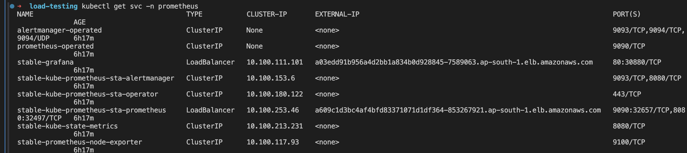

# Using k6-operator with AWS EKS and Docker

This guide provides step-by-step instructions on how to set up and use the k6-operator with AWS EKS, utilizing a custom-built Docker image of k6.

## Prerequisites

Before starting, ensure you have the following tools installed and configured:

- **AWS CLI**: Set up and configured with the appropriate permissions.
- **EKS Cluster** needs to be up and running. [Learn how to set up an EKS cluster in AWS cloud](https://aws.amazon.com/eks/getting-started/).
- **eksctl**: The official CLI for Amazon EKS.
- **kubectl**: The command line tool for Kubernetes.
- **k9s**: An optional Kubernetes CLI to manage clusters.
- **Docker**: For building and running containers.
- **helm**: Helm is a package manager for Kubernetes. Helm simplifies the installation of all components in one command
- For local Kubernetes cluster testing, **k3s** is recommended.


## Setup Prometheus and Grafana

This guide outlines the necessary steps to install Prometheus and Grafana in a Kubernetes environment using Helm. The process includes setting up the necessary Helm repositories, creating a namespace, installing the kube-prometheus-stack, and configuring service access.

The setup process involves adding Helm repositories, creating a Kubernetes namespace for Prometheus, installing the kube-prometheus-stack, and configuring services to make Prometheus and Grafana accessible externally. 


### 1. Add Helm Repositories

Add the necessary Helm repositories to your system:

```bash
# Add the Stable Charts repository
helm repo add stable https://charts.helm.sh/stable

# Add the Prometheus community repository
helm repo add prometheus-community https://prometheus-community.github.io/helm-charts
helm search repo prometheus-community
```
### 2. Create namespace and install kube-prometheus-stack


```bash
# This command installs Prometheus along with Grafana and sets up all required configurations.
helm install stable prometheus-community/kube-prometheus-stack -n prometheus

# this enables remote write to prometheus
helm upgrade stable prometheus-community/kube-prometheus-stack \
  --namespace prometheus \
  --reuse-values \
  --set "prometheus.prometheusSpec.enableFeatures[0]=remote-write-receiver"
```
### 3. Verify Installation

```bash
kubectl get pods -n prometheus
kubectl get svc -n prometheus
```

### 4. Configure Service Access

Modify the service type to LoadBalancer from ClusterIP to make Prometheus and Grafana accessible outside the Kubernetes cluster:

```bash
# Edit Prometheus service
kubectl edit svc stable-kube-prometheus-sta-prometheus -n prometheus

# Edit Grafana service
kubectl edit svc stable-grafana -n prometheus

# Verify changes and get the Load Balancer URL
kubectl get svc -n prometheus
```

### 5. Access Grafana UI
Navigate to the Grafana UI using the Load Balancer URL provided by the kubectl get svc command:
- **Username**: admin
- **Password**: prom-operator


## Gather Sources

For this demonstration, we will need to pull the code sources for the operator as well as any desired extensions. To keep things organized, we will place each repository in a `dependencies` directory.

```bash
# Pull down the operator which we'll install into Kubernetes.
git clone https://github.com/grafana/k6-operator.git dependencies/k6-operator

# Here you can find a list of extensions you might want to build the custom k6 build.
# https://k6.io/docs/extensions/get-started/explore/
git clone https://github.com/grafana/xk6-output-prometheus.git dependencies/xk6-output-prometheus
```

## Build customized K6 image
In order to create our k6 image using our desired extensions, we'll need to build using xk6. Our Dockerfile will set up our Go environment and handle the build.
```bash
# Build the image to be published
docker buildx build --platform linux/amd64 -t adityamodak/prom-k6-operator:latest .

# Publish your image to Dockerhub or whichever container registry your Kubernetes cluster can access.
docker push adityamodak/prom-k6-operator
```
## Install the k6-operator in cluster
```bash
cd dependencies/k6-operator
make deploy
cd ../..
```

## Resource Setup
Now that we have a working Kubernetes cluster, let's create an isolated Namespace and add our example test scripts as a ConfigMap.

```bash
# Let's create an isolated namespace for our testing
kubectl create namespace k6-demo

# Create a ConfigMap containing each of your test scripts
kubectl create configmap test-scripts -n k6-demo \
 --from-file=./test-scripts/simple.js \
 --from-file=./test-scripts/error.js 
```
## Running a distributed test
We need to provide prometheus remote url for k6 to send metrics. 
K6_PROMETHEUS_RW_SERVER_URL: Specifies the URL where k6 should send its Prometheus remote write requests. The URL points to the Prometheus service within the cluster, specifically configured to receive data on the default HTTP port 9090. 
- `http://<service-name>.<namespace-name>.svc.cluster.local:9090/api/v1/write`
```bash
# Create a ConfigMap with our non-secret configuration for our cloud account
kubectl create configmap -n k6-demo prometheus-config \
 --from-literal=K6_PROMETHEUS_RW_SERVER_URL=http://stable-kube-prometheus-sta-prometheus.prometheus.svc.cluster.local:9090/api/v1/write
```
To perform a distributed test, you simply apply the k6 custom resource definition (CRD) to your Kubernetes cluster using the standard kubectl tool.
```bash
# Adds the k6 CRD to trigger an test execution
kubectl apply -n k6-demo -f resources/k6-grafana.yaml
```
Once you've finished up, you can clear previous executions from your Kubernetes cluster in order to run the same script again.

```bash
# Post-test cleanup paves way for next test execution
kubectl delete -n k6-demo -f resources/k6-output-grafana-cloud.yaml
```


